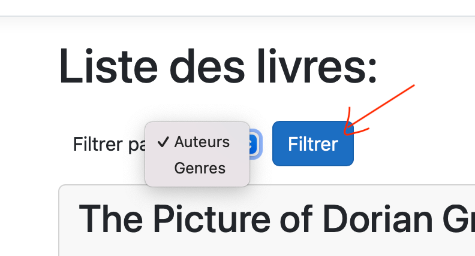
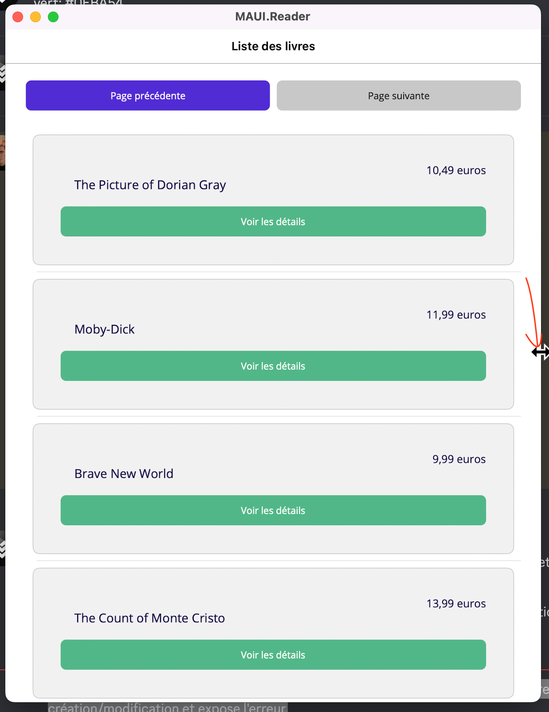

# TP .NET

# Membres
- Hoareau Quentin 
- Diallo Mamadou Mouctar
- Bihannic Pierre

# Fonctionnalité obligatoire développées
- ✅ Une interface d'administration (toutes les fonctionnalités ont été implémentées)
- ✅ Une API REST (toutes les fonctionnalités ont été implémentées)
- ✅ Cn Client lourd de lecture (toutes les fonctionnalités ont été implémentées)
- ✅ (Gestion de plusieurs auteurs)

# Fonctionnalité facultatives / options demandé et développées

### Une interface d'administration
- ✅ Remplacer le champs auteur (de type string) de la classe livre par une laison vers une classe Auteur
  - ✅ Un livre peut evoir plusieur autheur
  - ✅ La class autheur à besoin d'au minimum du nom de l'autheur
- ✅ Afficher des filtres dans la liste des livres pour filtrer par autheurs / genres
- ✅ Une page affichants les statistiques sur :
  - ✅ le nombre de libres total disponible
  - ✅ le nombre de livres par autheur
  - ✅ Le nombre maximum, minmum, median et moyen de mots d'un livre
- Importer les details d'un livre par l'OpenLibrary
  - ✅ https://openlibrary.org/
  - ✅ Pouvoir rentrer un contenu + isbn
  - ✅ récupéré l'auteur + description et l'ecrire en base

### Application Windows
- ✅ Gerer la pagination de vos livres (Scroll infini, pages ou autres)

# Fonctionnalité facultatives / options NON demandé et développées
- ✅ Gestion des erreurs : A la création, modification ou bien dans l'appel à l'API des livres, lorsqu'une erreur est commise, il reste sur la page de création/modification et expose l'erreur.

# Autre précision : 
- ⚠️ Dans le premier input, nous avons une liste proposant : Auteurs / Genres. En sélectionnant Auteur ou Genres : cela affiche dans l'ordre croissant, la liste des livres.
  

- ⚠️ Dans le premier input, nous avons la liste des auteurs. En sélectionnant un auteur et en cliquant sur obtenir, nous avons le nombre de livre qu'un autre (sélectionné) a écrit
  

- ⚠️ Si vous renconter un problème d'affichage sur la liste de livres, resize votre fenetre manuellement (ce problème est lié à macos normalement) :
